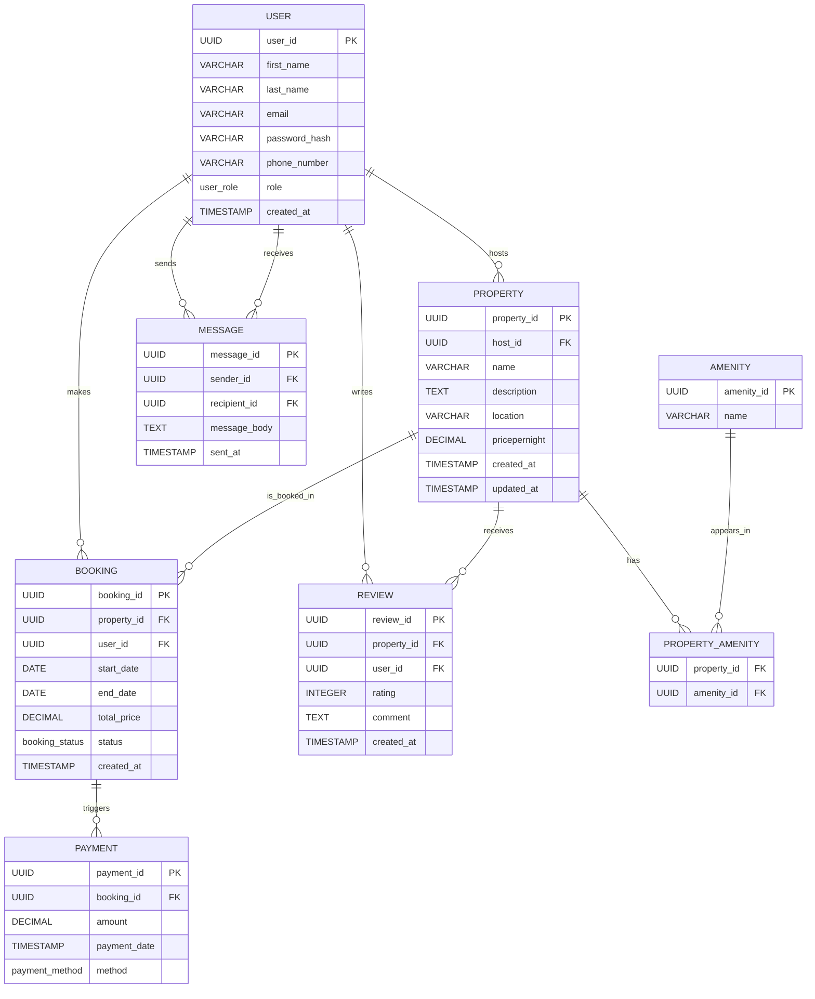

# ERD for Airbnb-like Application

```mermaid
erDiagram
    USER {
      UUID user_id PK
      VARCHAR first_name
      VARCHAR last_name
      VARCHAR email
      VARCHAR password_hash
      VARCHAR phone_number
      user_role role
      TIMESTAMP created_at
    }
    PROPERTY {
      UUID property_id PK
      UUID host_id FK
      VARCHAR name
      TEXT description
      VARCHAR location
      DECIMAL pricepernight
      TIMESTAMP created_at
      TIMESTAMP updated_at
    }
    BOOKING {
      UUID booking_id PK
      UUID property_id FK
      UUID user_id FK
      DATE start_date
      DATE end_date
      DECIMAL total_price
      booking_status status
      TIMESTAMP created_at
    }
    PAYMENT {
      UUID payment_id PK
      UUID booking_id FK
      DECIMAL amount
      TIMESTAMP payment_date
      payment_method method
    }
    REVIEW {
      UUID review_id PK
      UUID property_id FK
      UUID user_id FK
      INTEGER rating
      TEXT comment
      TIMESTAMP created_at
    }
    MESSAGE {
      UUID message_id PK
      UUID sender_id FK
      UUID recipient_id FK
      TEXT message_body
      TIMESTAMP sent_at
    }
    AMENITY {
      UUID amenity_id PK
      VARCHAR name
    }
    PROPERTY_AMENITY {
      UUID property_id FK
      UUID amenity_id FK
    }

    USER ||--o{ PROPERTY          : hosts
    USER ||--o{ BOOKING           : makes
    USER ||--o{ REVIEW            : writes
    USER ||--o{ MESSAGE           : sends
    USER ||--o{ MESSAGE           : receives
    PROPERTY ||--o{ BOOKING        : is_booked_in
    PROPERTY ||--o{ REVIEW         : receives
    BOOKING ||--o{ PAYMENT         : triggers
    PROPERTY ||--o{ PROPERTY_AMENITY: has
    AMENITY ||--o{ PROPERTY_AMENITY: appears_in
```
